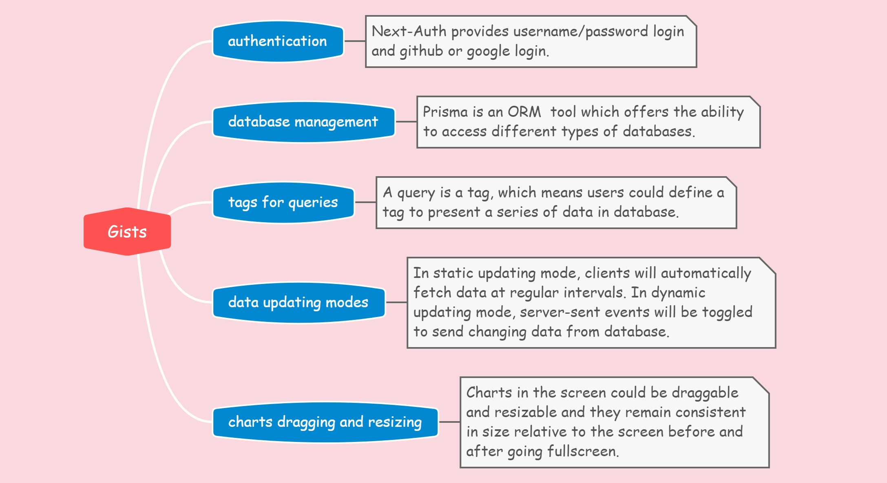
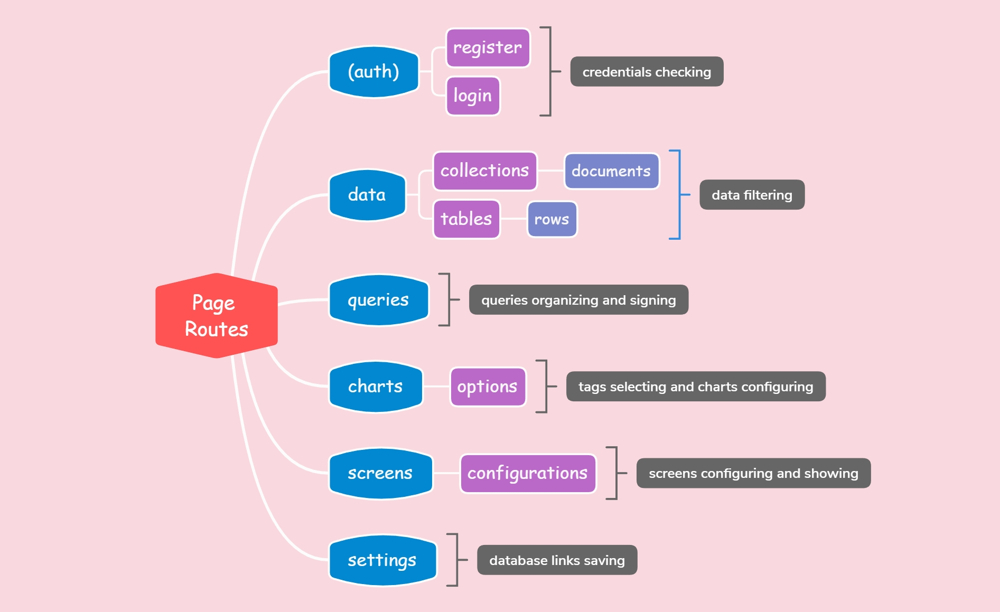
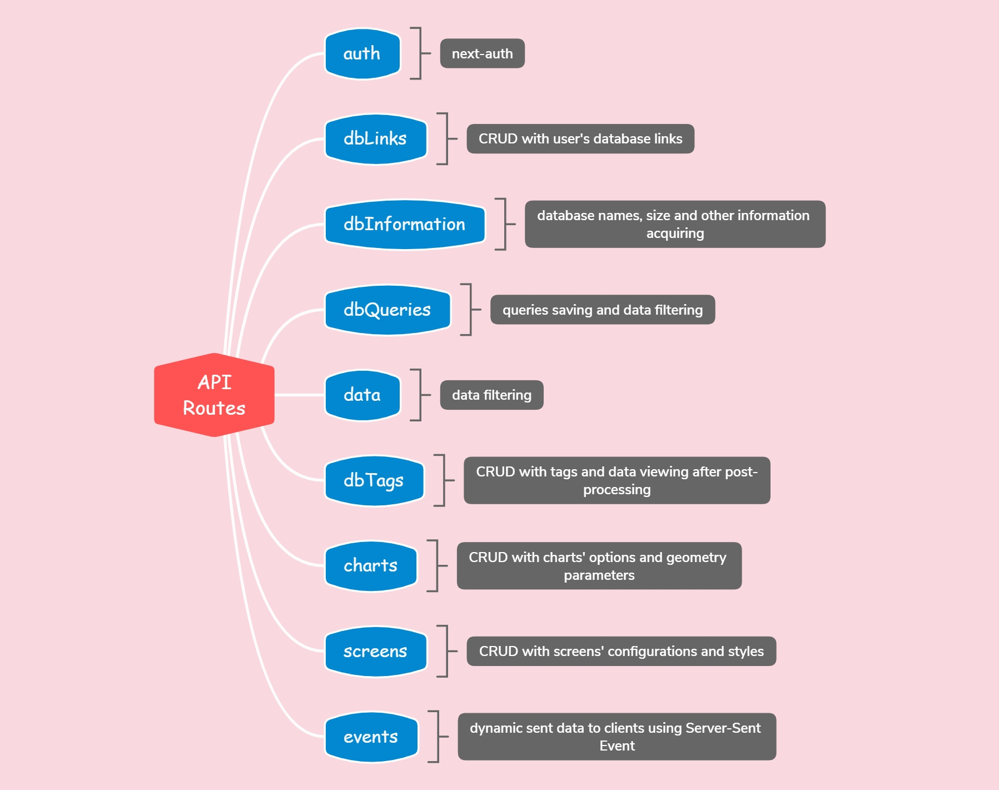
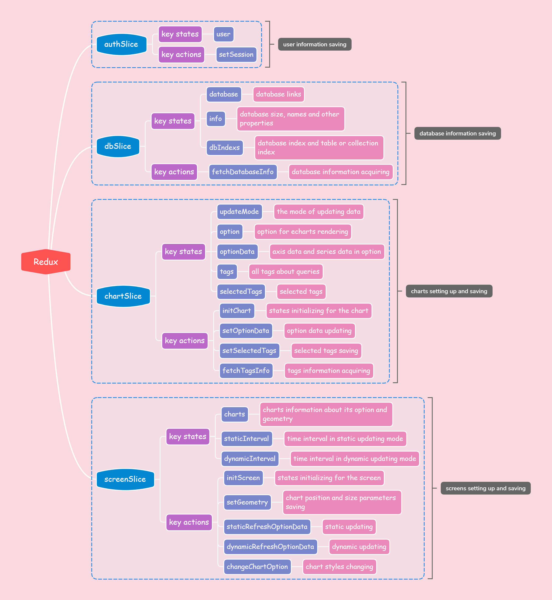

## YeloD

👓 **Draw your database by clicking**.

### Introduction

**YeloD** is designed to display database data either dynamically or statically, using various charts to effectively visualize the information.

This is my first project since learning Next.js and other relevant technologies. Currently, it is in the initial development stage, and there are still some issues that need to be addressed in future updates.

This project involves some key technologies: React.js, **Redux.js**, TypeScript, **Next.js**, NextAuth.js, MongoDB, MySQL, **Prisma**, ECharts, **Tailwind CSS**, Radix-UI.

### Gist

### Pages

### APIs

### Redux

